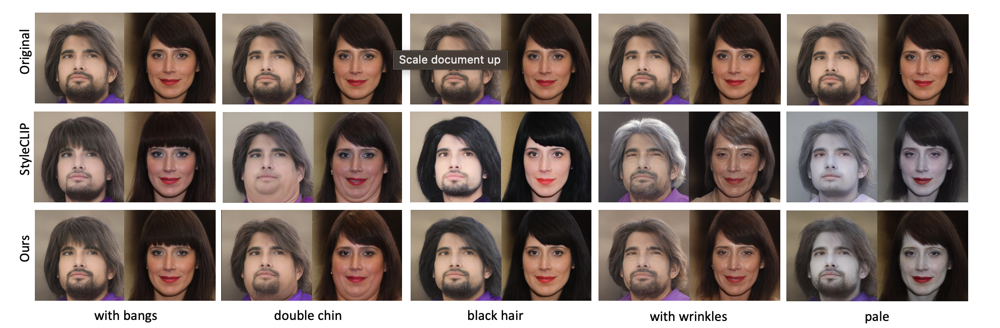

# PPE ✨
Repository for our CVPR'2022 paper:

[Predict, Prevent, and Evaluate: Disentangled Text-Driven Image Manipulation Empowered by Pre-Trained Vision-Language Model](https://arxiv.org/abs/2111.13333).
Zipeng Xu, Tianwei Lin, Hao Tang, Fu Li, Dongliang He, Nicu Sebe, Radu Timofte, Luc Van Gool, Errui Ding.
To appear in CVPR 2022.
</p>



Pytorch implementation is at: [zipengxuc/PPE-Pytorch](https://github.com/zipengxuc/PPE-Pytorch).

## Updates
_24 Mar 2022_: We update our arxiv-version paper.

_30 Mar 2022_: We have had some changes in releasing the code. Pytorch implementation is now at: [zipengxuc/PPE-Pytorch](https://github.com/zipengxuc/PPE-Pytorch).

_14 Apr 2022_: Update our PaddlePaddle inference code in this repository.

## To reproduce our results:
### Setup:

- Install CLIP:
    ```shell script
    conda install --yes -c pytorch pytorch=1.7.1 torchvision cudatoolkit=<CUDA_VERSION>
    pip install ftfy regex tqdm gdown
    pip install git+https://github.com/openai/CLIP.git
    ```
- Download pre-trained models:

    The code relies on the [PaddleGAN](https://github.com/PaddlePaddle/PaddleGAN/) (PaddlePaddle implementation of StyleGAN2).
Download the pre-trained model from [here](https://paddlegan.bj.bcebos.com/models/stylegan2-ffhq-config-f.pdparams).
    
    We provided several pretrained PPE models on [here](https://drive.google.com/file/d/1Xy4gmg1sJxXp10-mOBd7rmzmyi90uGFE/view?usp=sharing). 

- Invert real images:

    The mapper is trained on latent vectors, so it is necessary to invert images into latent space.
    To edit human face, [StyleCLIP](https://github.com/orpatashnik/StyleCLIP) provides the CelebA-HQ that was inverted by e4e:
 [test set](https://drive.google.com/file/d/16L7iyo7mDYuOnwGaQ5KaI7s-bloKzvHE/view?usp=sharing).

### Usage:
Please first put downloaded pretraiend models and data on "ckpt" folder.

#### Inference
In PaddlePaddle version, we only provide inference codes to generate editing results:
```shell script
python mapper/evaluate.py
```


## Reference
```
@article{xu2022ppe,
author = {Zipeng Xu and Tianwei Lin and Hao Tang and Fu Li and Dongliang He and Nicu Sebe and Radu Timofte and Luc Van Gool and Errui Ding},
title = {Predict, Prevent, and Evaluate: Disentangled Text-Driven Image Manipulation Empowered by Pre-Trained Vision-Language Model},
journal = {arXiv preprint arXiv:2111.13333},
year = {2021}
}
```

If you have any questions, please contact zipeng.xu@unitn.it. :)
