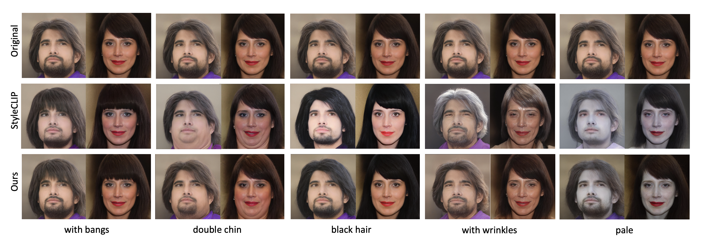

# PPE ✨
Pytorch implementation of the paper:

[Predict, Prevent, and Evaluate: Disentangled Text-Driven Image Manipulation Empowered by Pre-Trained Vision-Language Model](https://arxiv.org/abs/2111.13333).
Zipeng Xu, Tianwei Lin, Hao Tang, Fu Li, Dongliang He, Nicu Sebe, Radu Timofte, Luc Van Gool, Errui Ding.
To appear in CVPR 2022.
</p>




This code is reimplemented based on the [orpatashnik/StyleCLIP](https://github.com/orpatashnik/StyleCLIP).
We thank for their open sourcing.

## Updates
_24 Mar 2022_: Update our arxiv-version paper.

_26 Mar 2022_: Release code for reimplementing the experiments in the paper.

_To be continued..._

## To reproduce our results:
### Setup:
Same as StyleCLIP, the setup is as follows:

- Install CLIP:
    ```shell script
    conda install --yes -c pytorch pytorch=1.7.1 torchvision cudatoolkit=<CUDA_VERSION>
    pip install ftfy regex tqdm gdown
    pip install git+https://github.com/openai/CLIP.git
    ```
- Download pre-trained models:

    The code relies on the [Rosinality](https://github.com/rosinality/stylegan2-pytorch/) pytorch implementation of StyleGAN2.
Download the pre-trained StyleGAN2 generator from [here](https://drive.google.com/file/d/1EM87UquaoQmk17Q8d5kYIAHqu0dkYqdT/view?usp=sharing).
    
    The training also needs the weights for the facial recognition network used in the ID loss. 
Download the weights from [here](https://drive.google.com/file/d/1KW7bjndL3QG3sxBbZxreGHigcCCpsDgn/view?usp=sharing).

- Invert real images:

    The mapper is trained on latent vectors, so it is necessary to invert images into latent space.
    To edit human face, StyleCLIP provides the CelebA-HQ that was inverted by e4e:
[train set](https://drive.google.com/file/d/1gof8kYc_gDLUT4wQlmUdAtPnQIlCO26q/view?usp=sharing), [test set](https://drive.google.com/file/d/1j7RIfmrCoisxx3t-r-KC02Qc8barBecr/view?usp=sharing).

### Usage:
All procedures are conducted under the *mapper* directory, so please run:
```shell script
cd mapper
```
#### Predict
- ***Aggregate*** the images that are most relevant to the text command:
    
    ```shell script
    python scripts/randc.py --cmd "black hair"
    ```

- ***Find*** the attributes that appear most frequently in the command-relevant images:
    ```shell script
    python scripts/find_ancs.py --cmd "black hair"
    ```

#### Prevent
Train the mapper network with Entanglement Loss based on the found attributes (we call it "anchors" colloquially):
```shell script
python scripts/train.py --exp_dir ../results/black_hair_ppe --description "black hair" --anchors 'short eyebrows','with bangs','short hair','black eyes','narrow eyes','high cheekbones','with lipstick','pointy face','sideburns','with makeup'
```
#### Evaluate
Evaluate the manipulation with our evaluation metric:
```shell script
python scripts/evaluate.py --exp_dir ../results/black_hair_ppe --description "black hair" --anchors 'short eyebrows','with bangs','short hair','black eyes','narrow eyes','high cheekbones','with lipstick','pointy face','sideburns','with makeup'
```

## Reference
```
@article{xu2022ppe,
author = {Zipeng Xu and Tianwei Lin and Hao Tang and Fu Li and Dongliang He and Nicu Sebe and Radu Timofte and Luc Van Gool and Errui Ding},
title = {Predict, Prevent, and Evaluate: Disentangled Text-Driven Image Manipulation Empowered by Pre-Trained Vision-Language Model},
journal = {arXiv preprint arXiv:2111.13333},
year = {2021}
}
```

Please contact zipeng.xu@unitn.it if you have any question.
